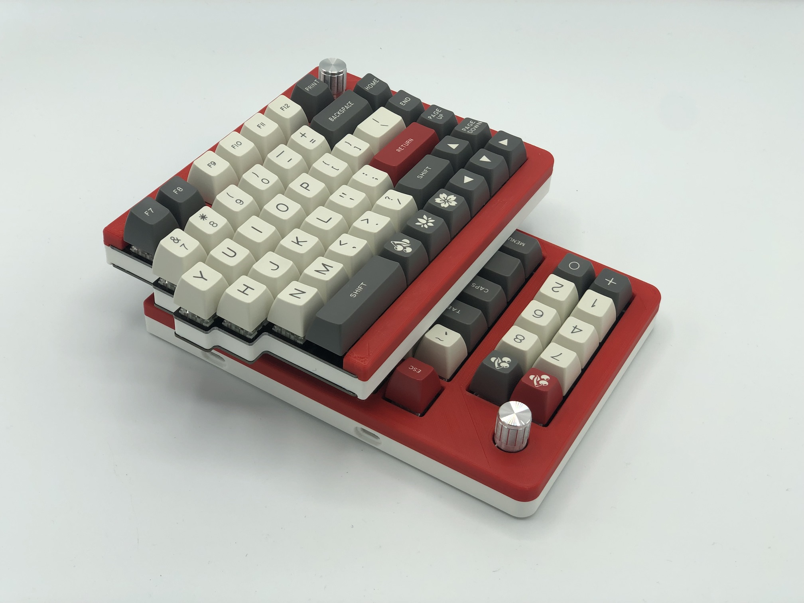

Sinc Keyboard Case
==================

Here's case design file for the [Sinc](https://keeb.io/products/sinc-split-staggered-75-keyboard). The .ai files have multiple layers to toggle on/off to generate the correct set of plates/mid-layers/etc.

3D Printed Middle Layers
------------------------

These are the STL files in the repository. These are an initial version of the design, as a more complete design with tighter cutouts for USB-C and TRRS ports will be made.

### New Enclosed Design

In the [enclosed-case](enclosed-case/) folder, there are STL files for a new design where the FR4 switch and bottom plates are used but have their sides covered. The top shell has been designed to be threaded into directly from underneath using long M2 screws.

For the Rev. 2, you will need [M2 screws that are 16mm](https://keeb.io/products/m2-screws-and-standoffs?variant=39401487040606) in length. For Rev. 1, due to the thicker mid layer, you will need 20mm screws.

License
-------
These case files are released under the MIT License.
